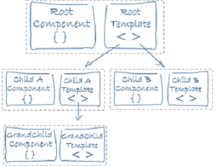
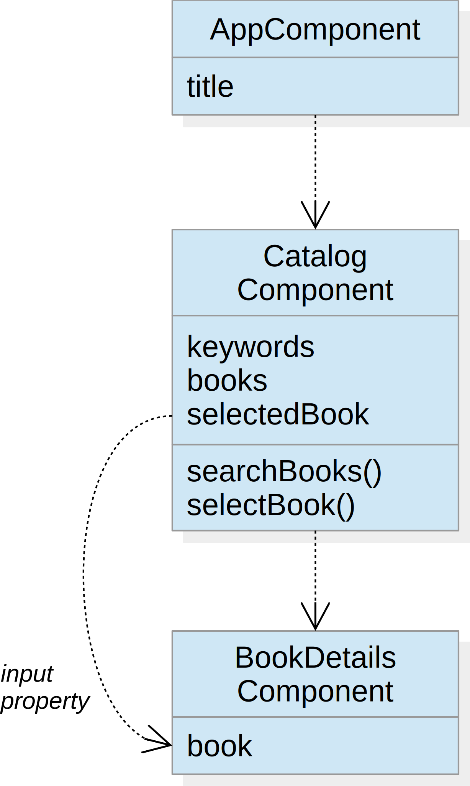
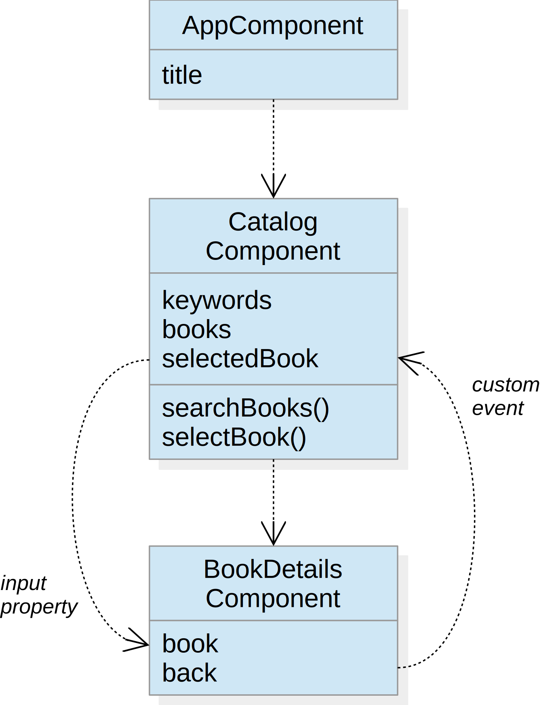

# Component Interaction



Objectives:
- Nested components
- Input properties
- Event emitters

---

## Book Details Component

Goal:<br>
Display the book details in a separate component

Technologies:
- Input properties
- Property binding

----

## Design



----

## Action Plan

1. Add the component `book-details` to the application
   - in the component define an input property `book`
   - in the template display the details of the book
2. In the catalog template
   - insert the book details component to display the selected book
   - add a property binding to pass the selected book to the details component

----

## Input Property

An input property of a component can be defined using the `@Input` decorator

Example
```typescript
export class BookDetailsComponent {
	@Input()
	public book: Book;
}
```

(details see [Component Interaction](https://angular.io/guide/component-interaction#parent-to-child))

----

## Input Property Binding

An input property binding allows to pass data from a parent component to its child components

Syntax
```typescript
[input-property]="expression"
```

Example
```html
<book-details [book]="selectedBook"></book-details>
```

(details see [Template Syntax](https://angular.io/guide/template-syntax.html#property-binding))

---

## Back Navigation

Goal:<br>
Enable a back navigation from the book details component

Technologies:
- Event emitter

----

## Design



----

## Action Plan

1. In the book details component add an event emitter property `back`
2. In the book details template add a button whose click event emits a custom back event
3. In the catalog template
   - remove the back button
   - bind the back event of the book details component such the selected book is cleared

----

## Event Emitter

An event emitter is an output property which can trigger custom events using its `emit` method

Example
```typescript
@Component(...)
export class BookDetailsComponent {
	...
	@Output()
	private back = new EventEmitter();
}
```

```html
<button (click)="back.emit()">Back</button>
```

(details see [Component Interaction](https://angular.io/guide/component-interaction#parent-listens-for-child-eventt))

----

## Custom Event Binding

A custom event binding allows to bind a child's custom event to a template statement

Syntax
```typescript
(event)="statement"
```

Example
```html
<book-details [book]="selectedBook" (back)="selectedBook=null"></book-details>
```

(details see [Template Syntax](https://angular.io/guide/template-syntax#event-binding))
