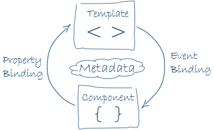

# Components



Objectives:
- Data bindings
- Structural directives

---

## Bookstore Application

- Create a new Angular application `bookstore`
- Change the application component's selector and title property
- Move the component's template to an external file

----

## CSS Frameworks

- Install the Bootstrap and Font Awesome packages<br>
  `npm install --save bootstrap font-awesome`
- Import the corresponding style sheets
- Use the Bootstrap styles and Font Awesome icons

src/styles.css
```css
@import "~bootstrap/dist/css/bootstrap.min.css";
@import "~font-awesome/css/font-awesome.min.css";
```

src/app/app.component.html
```html
<div class="container">
	<div class="jumbotron text-center">
		<h1>{{title}}</h1>
	</div>
</div>
```

(details see [Bootstrap](https://getbootstrap.com/docs/3.3/) and [Font Awesome](http://fontawesome.io/))

---

## Catalog Component

Goal:<br>
Display a list of books in a table

Technologies:
- Iteration directive
- Interpolation binding

----

## Design


----

## Action Plan

1. Add the component `catalog` to the application
2. Implement an enum `BookBinding` and a class `Book` that contains the data of a book
3. Add an array of books to the catalog component (example data see [book-data.ts](src/book-data.ts))
4. In the catalog template use the iteration directive to display the book data in a table
5. Insert the catalog component's selector into the application component's template

----

## Component Generation

The Angular CLI utility allows to add new components to an application:
```
ng generate component catalog
```

The component is automatically added to the declarations of the module:
```typescript
@NgModule({
	declarations: [AppComponent, CatalogComponent],
	...
})
export class AppModule {}
```

----

## Iteration Directive

The NgFor directive can be used to iterate over an array of objects

Syntax
```
*ngFor="let variable of array"
```

Example
```html
<tr *ngFor="let book of books">
	...
</tr>
```

(details see [Displaying Data](https://angular.io/guide/displaying-data#showing-an-array-property-with-ngfor))

----

## Interpolation Binding

An interpolation binding allows to display a component property (one-way binding)

Syntax
```
{{property}}
```

Example
```html
<td>{{book.isbn}}</td>
```

(details see [Displaying Data](https://angular.io/guide/displaying-data#interpolation))

---

## Book Details

Goal:<br>
By clicking on a row of the book table, the details of a book are displayed

Technologies:
- Condition binding
- Event binding
- Property binding

----

## Design


----

## Action Plan

1. In the catalog component add a property `selectedBook` and a method `selectBook()` that sets it
2. In the catalog template use
   - the condition directive to display the book table or the details of the selected book
   - an event binding to select a book in the table
4. Add a button whose click event clears the selected book

----

## Condition Directive

The NgIf directive inserts or removes a DOM element based on a condition

Syntax
```
*ngIf="expression"
```

Example
```html
<div *ngIf="!selectedBook">
	...
</div>
<div *ngIf="selectedBook">
	...
</div>
```

(details see [Displaying Data](https://angular.io/guide/displaying-data#conditional-display-with-ngif))

----

## Event Binding

An event binding binds an event to a template statement, e.g. a component method

Syntax
```
(event)="statement"
```

Examples
```html
<tr *ngFor="let book of books" (click)="selectBook(book)">
<button (click)="selectedBook=null">Back</button>
```

(details see [Template Syntax](https://angular.io/guide/template-syntax#event-binding))

----

## Property Binding

A property binding sets the property of a DOM element to the value of a template expression (one-way binding)

Syntax
```
[property]="expression"
```

Example
```html

```

(details see [Template Syntax](https://angular.io/guide/template-syntax#property-binding))

---

## Book Search

Goal:<br>
Books can be searched by keywords

Technologies:
- Two-way binding
- Event binding
- Condition directive

----

## Design


----

## Action Plan

1. Import the Angular forms module into the application module
2. In the catalog component add
   - a property `keywords`
   - a method `searchBooks()` that searches for books containing the keywords
3. In the catalog template add
   - an input field and bind its value to the `keywords` property
   - a button and bind its click event to the `searchBooks()` method
   - a condition directive to display the search results or an error message

----

## Angular Forms Module

The Angular forms module is needed to implement template-driven forms

```typescript
@NgModule({
	declarations: [...]
	imports: [BrowserModule, FormsModule]
	...
})
export class AppModule {}
```

----

## Two-way Data Binding

The NgModel directive binds the value of an input element to a component property such that both are kept in sync

Syntax
```
[(ngModel)]="property"
```

Example
```html
<input name="keywords" [(ngModel)]="keywords">
```

(details see [Template Syntax](https://angular.io/guide/template-syntax#two-way-binding))

<br>
A two-way data binding could also be achieved by combining a property and an event binding
```html
<input [value]="keywords" (input)="keywords=$event.target.value">
```
