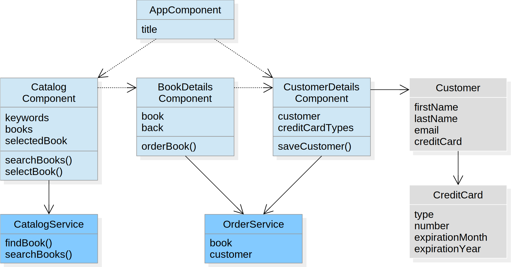
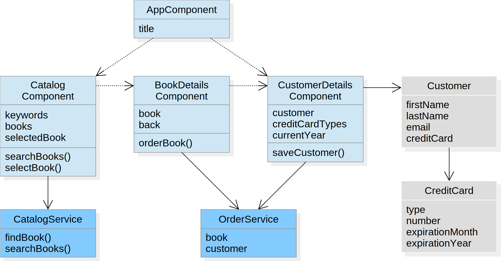

# Forms

Objectives:
- Form definition
- Form validation

---

## Customer Form

Goal:<br>
A customer can enter his or her details

Technologies:
- Form elements
- Form submission

----

## Design



----

## Action Plan

1. Implement a class `Customer` that holds the data of a customer (see [customer.ts](src/customer.ts))
2. In the order service add a property `customer` that represents the customer ordering a book
3. In the customer details component inject the order service and add
   - a property `customer` that hodls the customer data
   - a property `creditCardTypes` that holds the values of the enum `CreditCardType`
   - a method `saveCustomer` that saves the customer in the order service
4. In the template display a form with input controls that allows to enter the customer data
5. For the credit card type use a selection list whose options are derived from the enum `CreditCardType`
6. Add a submit button to the form and bind the `ngSubmit` event to the `saveCustomer` method

----

## Input Controls

The values of input controls can be bound to properties using the NgModel directive (two-way data binding)

Example
```html
<form>
	<label for="email">Email</label>
	<input id="email" name="email" [(ngModel)]="customer.email">
	...
</from>
```

----

## Selection List

The NgFor directive allows to generate the options of a selection list by binding the option values to array elements (property binding)

Example
```html
<select id="type" name="type" [(ngModel)]="customer.creditCard.type">
	<option *ngFor="let type of creditCardTypes" [value]="type">
		{{type}}
	</option>
</select>
```

----

## Form Submission

When a submit button is pressed, a submit event is emitted which can be bound to a component method (event binding)

Example
```html
<form (ngSubmit)="saveCustomer()">
	...
	<button type="submit">Save</button>
</form>
```

---

## Form Validation

Goal:<br>
The input controls of the customer form are validated

Technologies:
- Validation attributes
- Validation CSS styles
- Validation error messages

----

## Design



----

## Action Plan

1. In the customer form add the following validation attributes
   - `required` to all input controls
   - `pattern` to the email address and credit card number
   - `min` and `max` to the expiration month and year
2. Define the Angular CSS classes to highlight invalid input controls
3. Display appropriate error messages if an input control is invalid
4. Disable the submit button as long as the form is invalid

----

## Validation Attributes

- To validate a form, HTML validation attributes can be added to the input controls
- Angular uses directives to match these attributes with validator functions

Examples
```html
<label for="email">Email</label>
<input id="email" name="email" [(ngModel)]="customer.email" pattern="..." required>
```

(attributes see [Constraint validation](https://developer.mozilla.org/docs/Web/Guide/HTML/HTML5/Constraint_validation))

----

## State and Validity Tracking

The NgModel directive updates the input elements with Angular CSS classes to reflect their state

| Control state     | Class if true | Class if false |
|-------------------|---------------|----------------|
| visited           | ng-touched    | ng-untouched   |
| value has changed | ng-dirty      | ng-pristine    |
| value is valid    | ng-valid      | ng-invalid     |

Example
```css
.ng-invalid:not(form).ng-touched {
	border: 1px solid brown;
}
```

----

## Control Validity

- Whenever the value of an input control changes, Angular runs validation which results a status and possibly a list of errors
- A reference variable can be set to the NgModel directive in order to check the status and the errors of the control

Example
```html
<label for="email">Email</label>
<input name="email" [(ngModel)]="customer.email" #email="ngModel" pattern="..." required>
<div *ngIf="email.errors && (email.dirty || email.touched)">
	<div *ngIf="email.errors.required">
		required value
	</div>
	<div *ngIf="email.errors.pattern">
		invalid email address
	</div>
</div>
```

----

## Form Validity

- The NgForm directive supplements a form with additional features and has a valid property which is true if every contained control is valid
- A reference variable can be set to the NgForm directive in order to check the status of the form

Example
```html
<form (ngSubmit)="onSubmit()" #customerForm="ngForm">
	...
	<button type="submit" [disabled]="!customerForm.form.valid">Save</button>
</form>
```

(details see [Forms](https://angular.io/guide/forms#the-ngform-directive))
