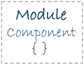
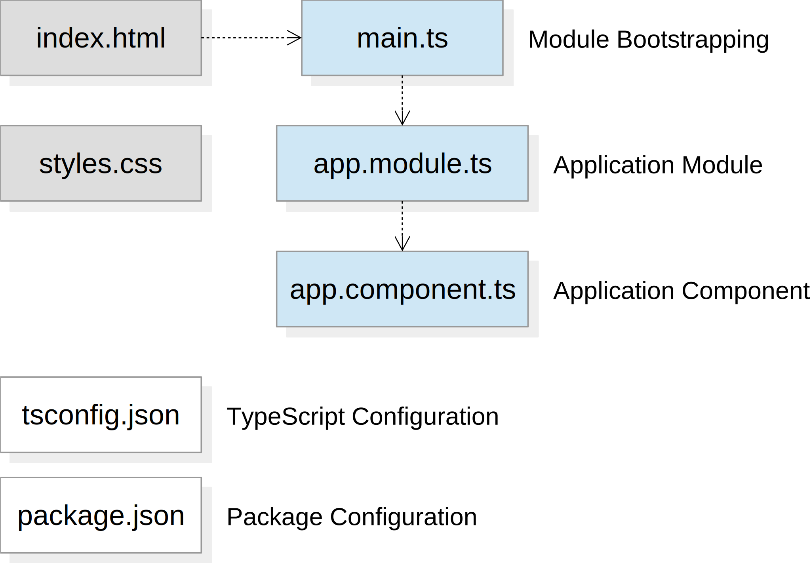
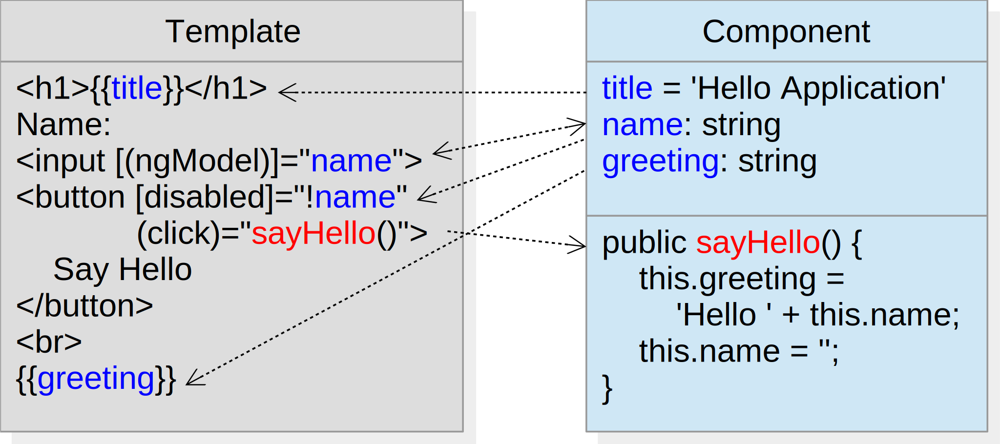

# Getting Started

---

## Introduction

- Angular is a framework for building single page applications in HTML and JavaScript
- Angular consists of several core and optional JavaScript libraries
- Angular applications are often used as front-end of backend applications


---

## Architecture


----

## Modules



- Angular applications consist of one root module and possibly several feature modules
- Modules are dedicated to an application domain, a workflow, or a closely related set of capabilities
- Metadata is used to define a module's dependencies

----

## Components


- Components are TypeScript classes that hold the data and control the behavior of their views
- Metadata tells Angular how to process the components

----

## Templates


- Templates define the component's views
- A template is an HTML document containing Angular elements to render the component

----

## Data Binding


Data binding synchronizes parts of a template with elements of the associated component:
- an *interpolation* displays a component's property
- a *property binding* sets the property of a view element to an expression value
- an *event binding* binds an event to a component's method
- a *two-way binding* combines property and event binding

----

## Directives


Angular renders templates by transforming the DOM according to directives:
- components define elements and their behavior
- structural directives alter the layout by adding and removing elements
- attribute directives alter the appearance or behavior of existing elements

----

## Services


Services implement data or logic that is used in different components, e.g.
- domain-specific calculations
- application-wide data cache
- communication with the backend application

Services are made available to components through dependency injection

---

## Angular CLI

Angular CLI is a command line utility to support application development

- Install Angular/CLI packages<br>
  `npm install -g @angular/cli`
- Create Angular application<br>
  `ng new hello --minimal`
- Change into application directory<br>
  `cd hello`
- Build application and start light-weight web server<br>
  `ng serve`
- Open web browser at<br>
  `http://localhost:4200`

---

## Application Artifacts



----

## Host Web Page

hello/src/index.html
```html
<!doctype html>
<html lang="en">
<head>
	<meta charset="utf-8">
	<title>Hello</title>
	<base href="/">
	<meta name="viewport" content="width=device-width, initial-scale=1">
	<link rel="icon" type="image/x-icon" href="favicon.ico">
</head>
<body>
<app-root></app-root>
</body>
</html>
```

- contains an element identified by the application component's selector
- will be complemented with script tags at build time

----

## Module Bootstrapping

hello/src/main.ts
```typescript
import { enableProdMode } from '@angular/core';
import { platformBrowserDynamic } from '@angular/platform-browser-dynamic';
import { AppModule } from './app/app.module';
import { environment } from './environments/environment';

if (environment.production) {
	enableProdMode();
}
platformBrowserDynamic().bootstrapModule(AppModule)
	.catch(err => console.log(err));
```

- sets up the execution environment
- creates a browser platform and bootstraps the application module
- instantiates the application component and inserts it into the host web page

----

## Application Module

hello/src/app/app.module.ts
```typescript
import { BrowserModule } from '@angular/platform-browser';
import { NgModule } from '@angular/core';
import { AppComponent } from './app.component';

@NgModule({
	declarations: [AppComponent],
	imports: [BrowserModule],
	providers: [],
	bootstrap: [AppComponent]
})
export class AppModule {
}
```

- declares the application components, directives and pipes
- imports supporting modules
- specifies service providers
- defines the application component to bootstrap

----

## Application Component

hello/src/app/app.component.ts
```typescript
import { Component } from '@angular/core';

@Component({
	selector: 'app-root',
	template: `
		<h1>Welcome to {{title}}!</h1>
		...
	`,
	styles: []
})
export class AppComponent {
	title = 'app';
}
```

- defines the component's
  - CSS selector
  - HTML template &ndash; inline or by location (templateUrl)
  - CSS styles &ndash; inline or by location (styleUrls)
- implements the component class

----

## TypeScript Configuration

hello/src/tsconfig.json
```json
{
	"compileOnSave": false,
	"compilerOptions": {
		"outDir": "./dist/out-tsc",
		"sourceMap": true,
		"declaration": false,
		"moduleResolution": "node",
		"emitDecoratorMetadata": true,
		"experimentalDecorators": true,
		"target": "es5",
		"typeRoots": [
			"node_modules/@types"
		],
		"lib": [
			"es2017",
			"dom"
		]
	}
}
```

- defines options of the TypeScript compiler

----

## Package Configuration

hello/src/package.json
```json
{
	"name": "hello",
	"version": "0.0.0",
	"license": "MIT",
	"scripts": {
		"ng": "ng",
		"start": "ng serve",
		"build": "ng build",
		"test": "ng test",
		"lint": "ng lint",
		"e2e": "ng e2e"
	},
	"private": true,
	"dependencies": {
		"@angular/animations": "^5.0.0",
		"@angular/common": "^5.0.0",
		"@angular/compiler": "^5.0.0",
		"@angular/core": "^5.0.0",
		"@angular/forms": "^5.0.0",
		"@angular/http": "^5.0.0",
		"@angular/platform-browser": "^5.0.0",
		"@angular/platform-browser-dynamic": "^5.0.0",
		"@angular/router": "^5.0.0",
		"core-js": "^2.4.1",
		"rxjs": "^5.5.2",
		"zone.js": "^0.8.14"
	},
	"devDependencies": {
		"@angular/cli": "1.5.0",
		"@angular/compiler-cli": "^5.0.0",
		"@angular/language-service": "^5.0.0",
		"typescript": "~2.4.2"
	}
}
```

- defines lifecycle scripts and dependent packages

---

## Action Plan

1. Component selector
2. Component template (interpolation)
3. External template
4. Input field (two-way binding)
5. Button (event binding)
6. Disabled button (property binding)

----

## Task 1

- Change the application component's selector

hello/src/app/app.component.ts
```typescript
@Component({
	selector: 'hello',
	...
})
export class AppComponent { ... }
```

hello/src/index.html
```html
<body>
<hello></hello>
</body>
```

----

## Task 2

- Change the component's `title` property and simplify the component's template

hello/src/app/app.component.ts
```typescript
@Component({
	selector: 'hello',
	template: `<h1>{{title}}</h1>`,
	styles: []
})
export class AppComponent {
	public title = 'Hello Application';
}
```

----

## Task 3

- Move the component's template to an external file

hello/src/app/app.component.ts
```typescript
@Component({
	selector: 'hello',
	templateUrl: 'app.component.html',
	styles: []
})
export class AppComponent {
	public title = 'Hello Application';
}
```

hello/src/app/app.component.html
```html
<h1>{{title}}</h1>
```

----

## Task 4

- Add the `FormsModule` to the imports of the application module
- Add a property `name` to the component that holds the user's name
- Add an input field and bind its value to the property (two-way binding)
- Display a greeting message in the template containing the user's name 

hello/src/app/app.component.ts
```typescript
@Component({ ... })
export class AppComponent {
	public title = 'Hello Application';
	public name: string;
}
```

hello/src/app/app.component.html
```html
<h1>{{title}}</h1>
Name: <input [(ngModel)]="name">
<br><br>
Hello {{name}}!
```

----

## Task 5

- Add a method `sayHello()` which sets a property `greeting` depending on the user's name
- Add a button to the template and bind its click event to the method (event binding)
- Display the `greeting` property using an interpolation

hello/src/app/app.component.ts
```typescript
@Component({ ... })
export class AppComponent {
	public title = 'Hello Application';
	public name: string;
	public greeting: string;

	public sayHello() {
		this.greeting = 'Hello ' + this.name + '!';
		this.name = '';
	}
}
```

hello/src/app/app.component.html
```html
<h1>{{title}}</h1>
Name: <input [(ngModel)]="name">
<button (click)="sayHello()">Say Hello</button>
<br><br>
{{greeting}}
```

----

## Task 6

- Add the attribute `disabled` to the button and bind its value such that the button is only enabled when the input field is not empty (property binding)

hello/src/app/app.component.html
```html
<h1>{{title}}</h1>
Name: <input [(ngModel)]="name">
<button (click)="sayHello()" [disabled]="!name">Say Hello</button>
<br><br>
{{greeting}}
```

---

## Summary

The following data bindings have been established between the template and the component


