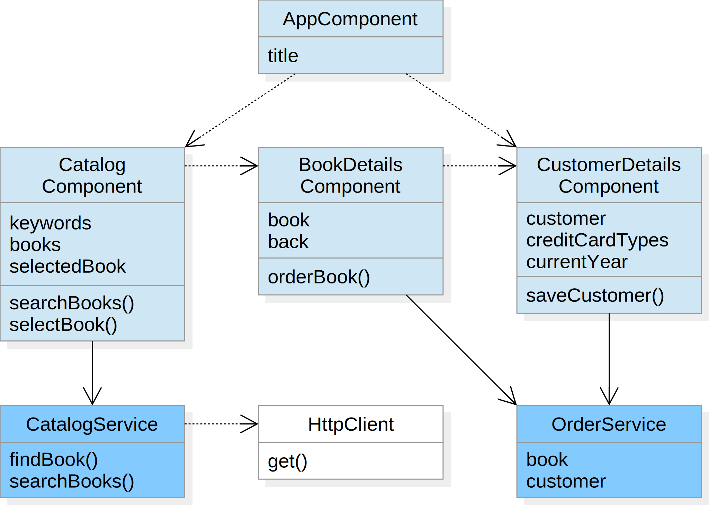
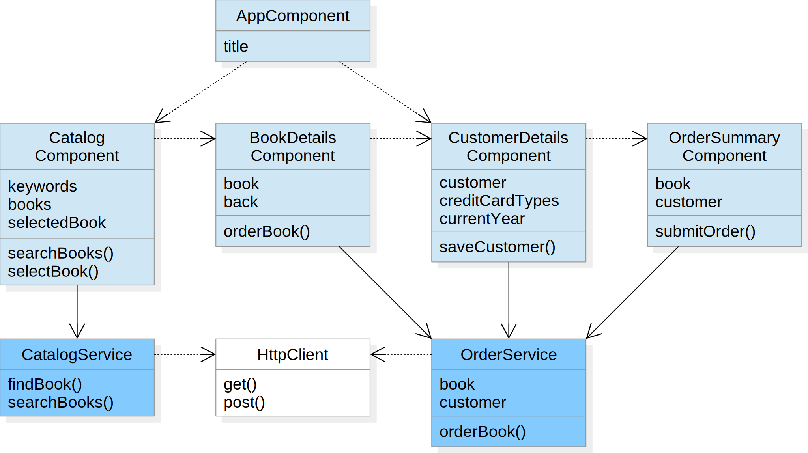

# HTTP

Objectives:
- Invoking backend services

---

## Catalog Search

Goal:<br>
Books are searched using a backend catalog service

Technologies:
- Retrieving data
- Error handling

----

## Components



----

## Action Plan

1. Import the Angular HTTP client module into the application module
2. Inject the HTTP client into the catalog service
3. Use the get method of the HTTP client to search books in the backend catalog service

----

## HTTP Client Module

The Angular HTTP client module allows Angular applications to communicate with backend services over the HTTP protocol

Example
```typescript
@NgModule({
	imports: [
		...,
		HttpClientModule
	],
	...
})
export class AppModule {}
```

----

## HTTP Client

The Angular HTTP client provides a simplified API for HTTP requests based on the `XMLHttpRequest` object

Example
```typescript
@Injectable()
export class CatalogService {
	constructor(private httpClient: HttpClient) {}
	...
}
```

----

## Retrieving Data

- The get() method can be used to retrieve JSON data from a backend service
- The JSON response data is parsed into an object whose type is given by the type parameter
- The response is returned as an RxJS Observable which can be converted to a Promise

Example
```typescript
public searchBooks(keywords: string): Promise<Book[]> {
	let url = ...
	return this.httpClient.get<Book[]>(url).toPromise()
		.then(...)
		.catch(...);
}
```

(details see [HTTP Get Request](https://angular.io/guide/http#making-a-request-for-json-data))

----

## Error Handling

- If the service returns an unsuccessful response or another error occurs, an `HttpErrorResponse` is returned
- The response contains the HTTP status and an optional response body

Example
```typescript
public searchBooks(keywords: string): Promise<Book[]> {
	let url = ...
	return this.httpClient.get<Book[]>(url).toPromise()
		.then(...)
		.catch((response: HttpErrorResponse) => {
			console.log('HTTP status ' + response.status + ': ' + response.error);
			throw response.error;
		});
}
```

(details see [HTTP Error Handling](https://angular.io/guide/http#error-handling))

---

## Order Submission

Goal:<br>
Orders can be submitted to a backend order service

Technologies:
- Submitting data
- Request headers

----

## Components



----

## Action Plan

1. Inject the Angular HTTP client into the order service and add a method `orderBook` that submits the an order to the backend order service
2. Implement a component `order-summary` that displays the selected book and the customer data from the order service
3. Add a button to the template that is bound to a `submitOrder` method which invokes the `orderBook` method of the order service
4. In the customer details component navigate to the order summary component after having saved the customer data

----

## Submitting Data

The post() method of the Angular HTTP client can be used to submit data to a backend service

Example
```typescript
public orderBook(): : Promise<number> {
	let url = ...
	return this.httpClient.post<number>(url, this.customer).toPromise()
		.then(...)
		.catch(...);
}
```

(details see [HTTP POST Request](https://angular.io/guide/http#making-a-post-request))

----

## Request Headers

Request headers can be provided by adding an options object to the request method

Example
```typescript
public orderBook(): : Promise<number> {
	let url = ...
	let httpOptions = {
		headers: new HttpHeaders({ 'Content-Type': 'application/json' })
	};
	return this.httpClient.post<number>(url, this.customer, httpOptions).toPromise()
		.then(...)
		.catch(...);
}
```

(details see [HTTP Configuring Request](https://angular.io/guide/http#configuring-other-parts-of-the-request))
