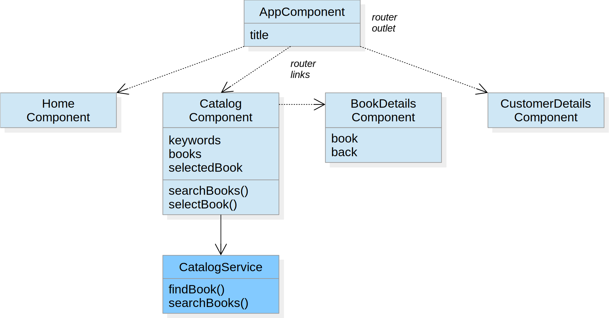
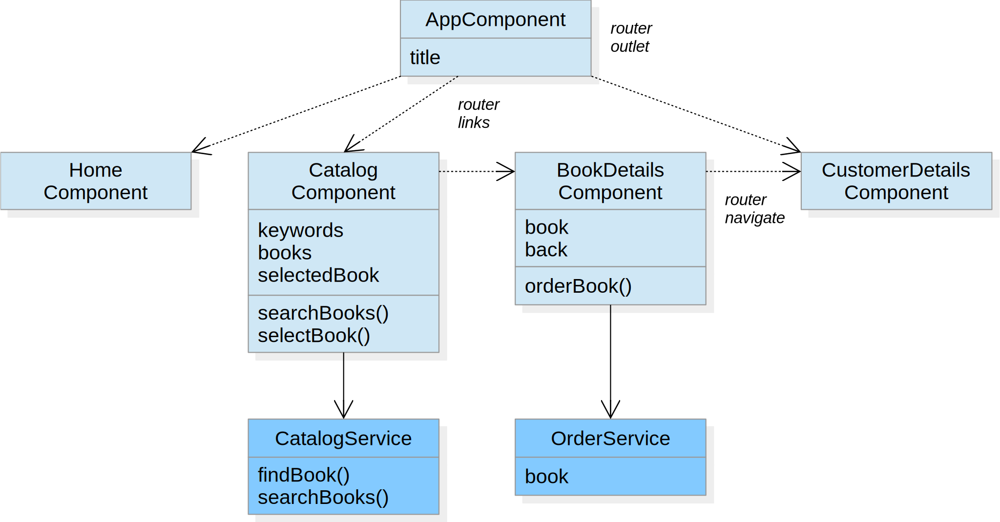

# Routing

Objectives:
- Navigation routes
- Router links
- Router service

---

## Navigation Menu

Goal:<br>
Add a navigation menu to the bookstore application

Technologies:
- Navigation routes
- Router outlet
- Router links

----

## Design



----

## Action Plan

1. Implement a component `home` that displays a welcome message or image
2. Add a component `customer-details` that will be used to enter the customer details
3. Define navigation routes and import the Angular router module into the application module
4. Add the RouterOutlet directive to the application component
5. Add a navigation menu with router links to the home, catalog and customer details component

----

## Navigation Routes

A navigation route consists of
- a path which the router matches to the URL in the browser address bar
- the component that the router creates when navigating to this route

Example
```typescript
const routes: Routes = [
	{ path: '', redirectTo: 'home', pathMatch: 'full' },
	{ path: 'home', component: HomeComponent },
	{ path: 'catalog', component: CatalogComponent },
	{ path: 'customer-details', component: CustomerDetailsComponent },
	{ path: '**', component: HomeComponent }
];
```

The wildcard route matches all paths and hence should be at the end of the routes list

----

## Router Module

The Angular router module contains the router service that is configured by navigation routes

Example
```typescript
@NgModule({
	imports: [
		...,
		RouterModule.forRoot(routes)
	],
	...
})
export class AppModule {}
```

----

## Router Outlet

The RouterOutlet directive tells the router where to display the target view of a navigation route

Example
```html
<h1>Angular Bookstore</h1>
...
<router-outlet></router-outlet>
```

----

## Router Links

The RouterLink directive tells the router where to navigate when an input element is clicked

Example
```html
<h1>Angular Bookstore</h1>
<a routerLink="/home" routerLinkActive="active-link">Home</a>
<a routerLink="/catalog" routerLinkActive="active-link">Catalog</a>
<a routerLink="/customer-details" routerLinkActive="active-link">Customer</a>
...
```

The RouterLinkActive directive adds a CSS class to the element when the link becomes active

---

## Order Service

Goal:<br>
A book can be marked to order

Technologies:
- Router service

----

## Design



----

## Action Plan

1. Implement an order service that holds a book to be ordered
2. Inject the order service and the Angular router service into the book details component
3. Add the method `orderBook` that marks the current book to order and then navigates to the customer details component
4. In the template of the book details component add a button to order the displayed book

----

## Router Service

The router service can be used to explicitly navigate to a component by providing a path and optional parameters

Example
```typescript
export class BookDetailsComponent {
	...
	constructor(private router: Router) {}

	public orderBook(): void {
		...
		this.router.navigateByUrl('/customer-details');
	}
}				
```
