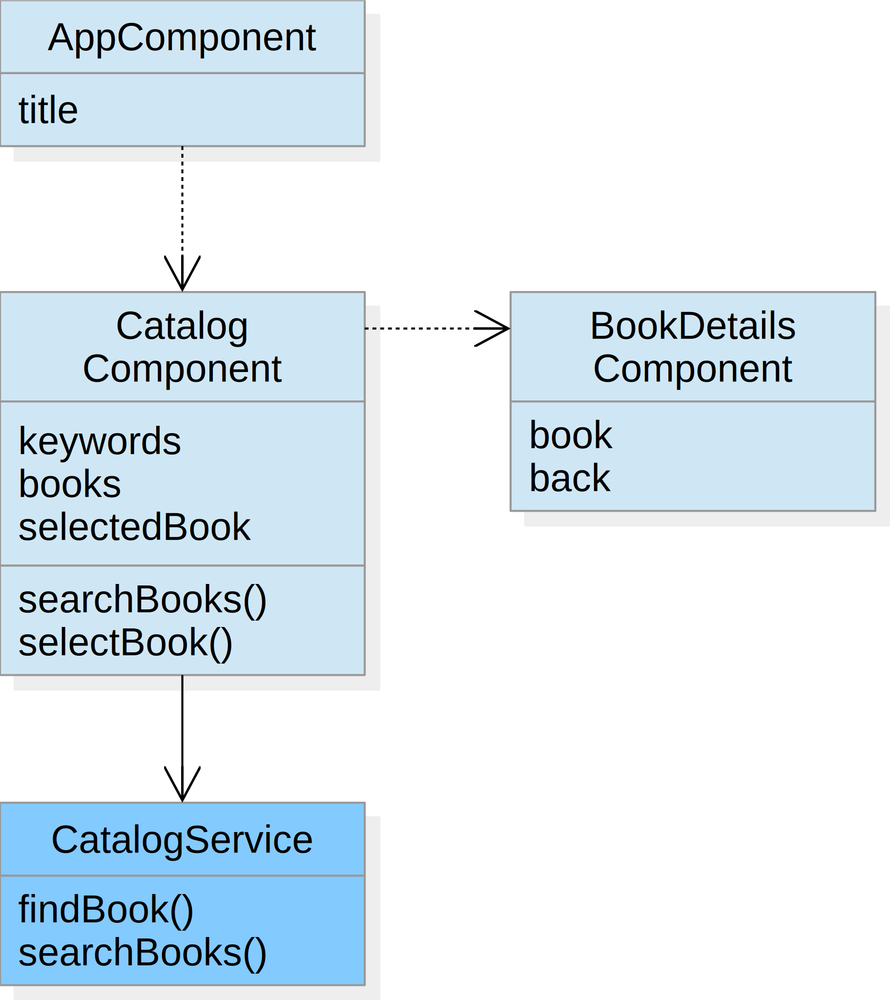
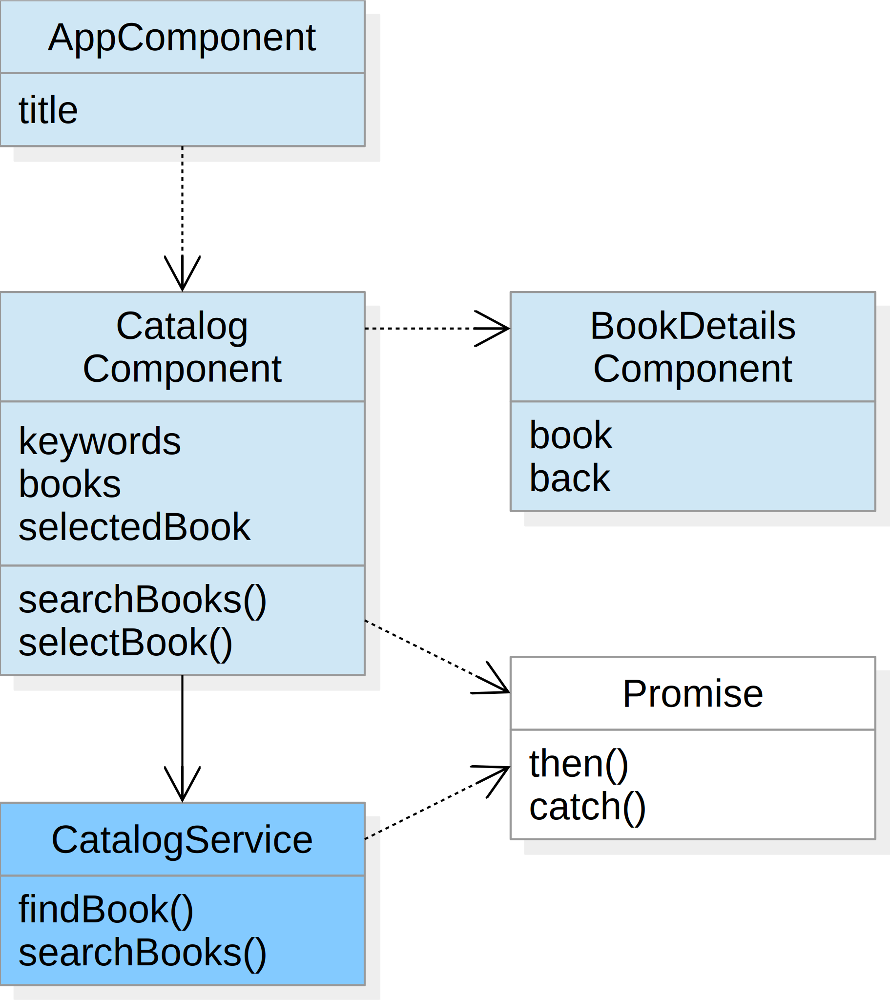
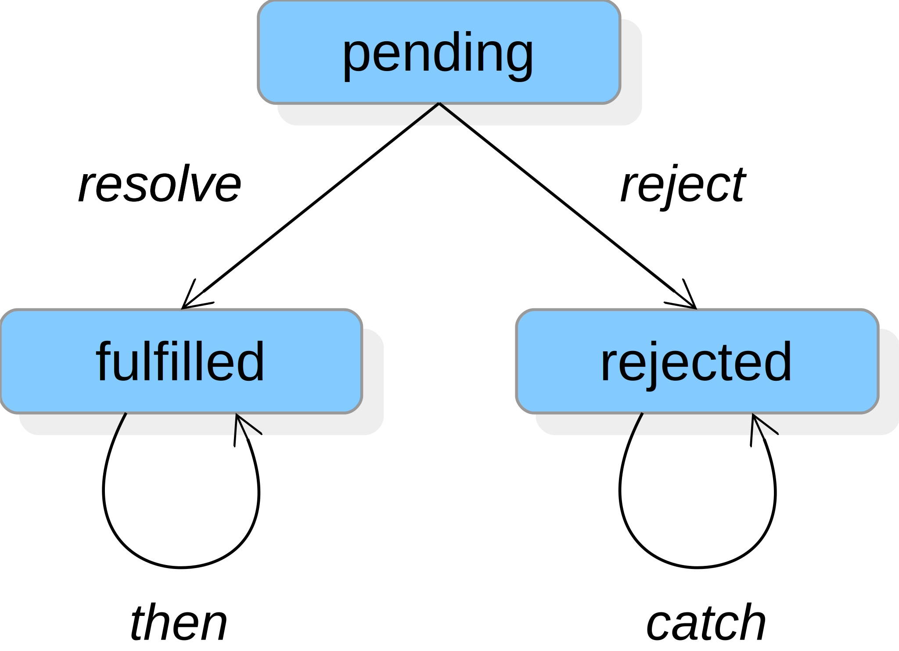

# Services


Objectives:
- Service implementation
- Service injection
- Asynchronous services

---

## Catalog Service

Goal:<br>
The book search is implemented as a service

Technologies:
- Service implementation
- Service injection

----

## Design



----

## Action Plan

1. Add a service `catalog` to the bookstore application
2. Implement a `findBook` method that finds a book by its ISBN number and a `searchBooks` method that searches for books by keywords
3. Inject the service into the catalog component and delegate the book search to it

----

## Service Generation


The Angular CLI utility allows to add new services to an application
```
ng generate service catalog --module=app.module
```

The service is automatically added to the providers of the module
```typescript
@NgModule({
	...
	providers: [CatalogService],
	...
})
export class AppModule {}
```

----

## Service Implementation

- A service implements application logic that can be used in different components
- The @Injectable() decorator is needed to inject other dependencies into the service

Example
```typescript
@Injectable()
export class CatalogService {
	public findBook(isbn: string): Book {
		...
	}
	public searchBooks(keywords: string): Book[] {
		...
	}
}
```

(details see [Dependency Injection](https://angular.io/guide/dependency-injection#injectable))

----

## Service Injection

A service can be injected into a component by adding a corresponding parameter to the constructor

Example
```typescript
@Component(...)
export class CatalogComponent {
	constructor(private catalogService: CatalogService) {}
	...
}
```

(details see [Dependency Injection](https://angular.io/guide/dependency-injection))

---

## Asynchronous Service

Goal:<br>
The catalog service is invoked asynchronously

Technologies:
- Promises

----

## Design



----

## Action Plan

1. Modify the catalog service such that its methods return a Promise
2. In the catalog component consume the Promise returned by the catalog service
3. Add a delay to the catalog methods to simulate network latency

----

## Promises

- Instead of passing callbacks to an asynchronous function, a function may return a Promise
- A Promise is a proxy object of a future value and has the following states:
  - pending &ndash; the promise has no outcome yet
  - fulfilled &ndash; the function completed and the promise has a value
  - rejected &ndash; the function failed and the promise has an error


  
(details see [Understanding JavaScript Promise](https://spring.io/understanding/javascript-promises))

----

## Consuming Promises

When an asynchronous function returns a Promise, its `then` and `catch` methods can be used to process the result or to handle an error of the function

```typescript
function foo(): Promise<T> { ... }

foo()
	.then((result: T) => {
		/* process result */
		...
	})
	.catch((error: any) => {
		/* handle error */
		...
	});
```

If the processing of the result returns a new result, the `then` calls can be chained

```typescript
foo()
	.then(result => { ... })
	.then(result => { ... })
	.catch(error => { ... });
```

----

## Creating Promises

When a Promise is created, it gets a `resolve` and a `reject` function which can be used to return the result or an error, respectively

```typescript
function foo(): Promise<T> {
	return new Promise<T>((resolve, reject) => {
		/* compute result */
		...
		if (/* success */)
			resolve(result)
		else reject(error);
	};
}
```

Example
```typescript
function divide(x: number, y: number): Promise<number> {
	return new Promise<number>((resolve, reject) => {
		if (y) resolve(x/y);
		else reject('division by zero');
	};
}
```

